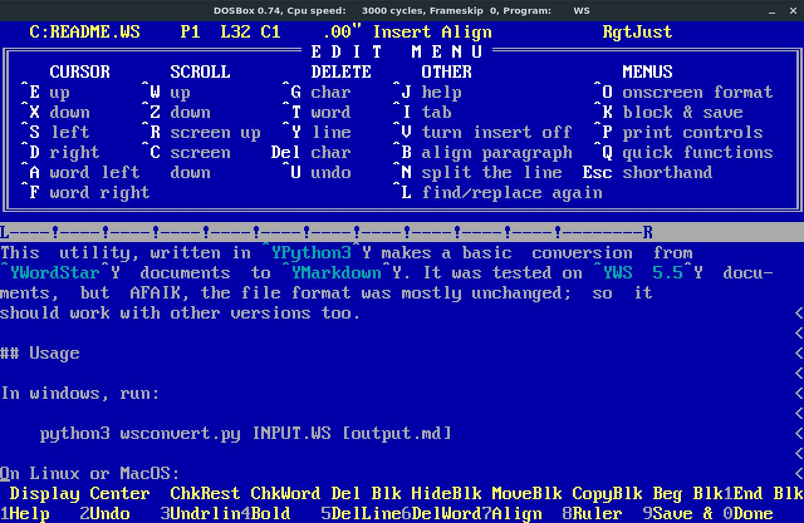

# Simple Wordstar to Markdown converter

This is a simple conversion utility written in Python to convert documents created with the *WordStar* word processor to more modern formats.

## Introduction

 [**Wordstar**](https://en.wikipedia.org/wiki/WordStar), one of the most popular an powerful word processor of the '80s, is still considered a very capable word processor, with focus on writing, no distractions, no breaks in the flow of writing. Some [writers](https://en.wikipedia.org/wiki/WordStar#Notable_users) still use it as a main tool for writing. Its keyboard shortcuts are still available as plugins for several text editors and word processors.

If you would like to try it, it can be run in a DosBox virtual machine. You can find a copy on Dos abandonware websites. I prefer version 5.5, as it automatically reflows the text as you write and has complete document style settings using the dot commands.

As WordStar was totally abandoned in the Windows era, currently no complete conversion utility exists to read or convert WordStar documents.

This utility, written in *Python3* makes a basic conversion from *WordStar* documents to formatted *Markdown* or unformatted text. It was tested on *WS 5.5* documents, but AFAIK, the file format was mostly unchanged; so it should work with other versions too.

## Prerequisites

- **Python 3** - needed to execute the program
- (Optional) **Pandoc** - to further convert Markdown (html, docx, odf, epub...)
- (Optional) **MikTex** or **TexLive** - for Pandoc PDF conversion.

## Usage

usage: `python3 wsconvert.py [-h] [-o OUTPUT] [-t] ws_file`

Required arguments:
- ws_file                     the WordStar file to convert

Optional arguments:
- -h, --help                  show this help message and exit
- -o OUTPUT, --output OUTPUT  output file name
- -t, --textmode              output to unformatted (text) file

## Why Markdown

Markdown is an easy to understand file format, with a good set of text formatting options. Easy and intuitive to learn and write; it's also simple to convert from/to other formats.

The **Pandoc** utility can convert Markdown to most document formats: *docx*, *pdf*, *epub*, *latex*... This utility uses some Pandoc specific markdown features (superscript, subscript, footnote...) that might not be recognized by some converters.

Markdown can also be used directly in several webpages (*Github*, *Medium* etc.)

## Features and bugs

WSConvert will convert your WordStar documents to a format which is readable by modern systems. It strips the binary (formatting) data from the text that stops the text editors from reading the files.

It has two output modes: the *text mode* keeps only the text from the document, the *markdown* mode keeps the most important part of the formatting.

In Markdown the page layout is handled by the output tmplates, not the document itself. That's why data like font, text justification, paragraph margins, columns are not kept.

**Features:**

- WordStar specific data (dot commands and symmetric blocks) is stripped from the document
- Special character handling (like accents)
- Text formatting (**bold**, *italic*, underline, strikethrough, superscript, subscript, etc).
- Paragraph style handling (title=>#, heading=>##)
- Tabs converted to 4 spaces
- Footnotes and endnotes are handled (transformed into markdown style footnotes)

**Still to do:**

- Smart newline handling (don't add empty lines to lists and codeblocks)
- Transfer some useful dot commands:
    - `..` comment
    - `.df`, `.fi` insert data/text file
- Convert WS tables to MD

**Don't hesitate to participate in this project: code cleanup and new features are more than welcome.**

More information on the Wordstar format:
- https://sfwriter.com/wsformat.txt
- http://fileformats.archiveteam.org/wiki/Wordstar

More on Markdown and Pandoc:
- https://pandoc.org/MANUAL.html

## License

This program is distributed under the **General Public Licence** (GPL), version 2 or later. For the full terms and conditions, please refer to the LICENSE file.
